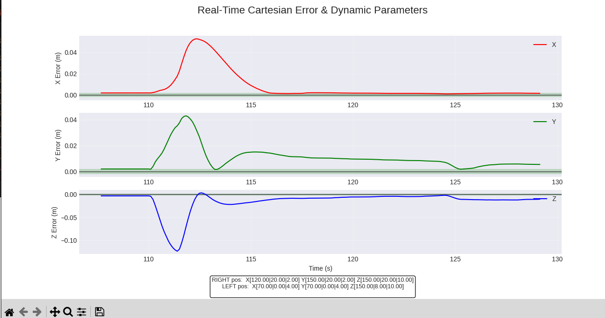
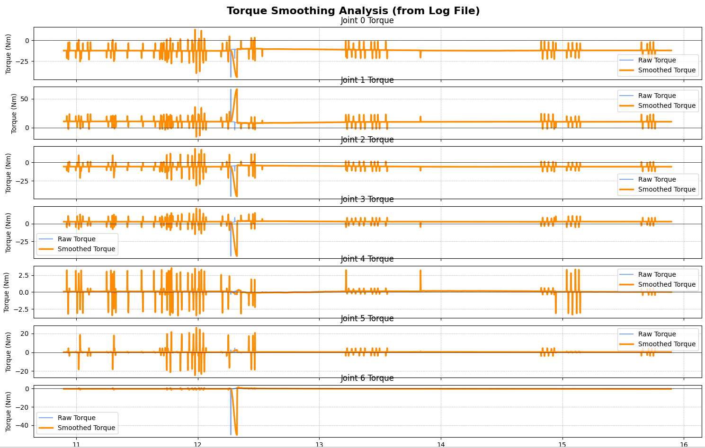

# Quick Start

**Install dependencies:**

```bash
pip install -r requirements.txt
```

# Cartesian Error Visualizer
Real-time visualization of cartesian position and orientation errors from dual-arm robot manipulators.

**Run the demo:**

```bash
# Terminal 1: Run the demo error publisher
python demo_error_publisher.py

# Terminal 2: Run the visualizer
python cartesian_error_visualizer.py
```

## What It Does

Subscribes to cartesian error topics and plots:

- **Linear errors** (X, Y, Z position) in meters
- **Angular errors** (Roll, Pitch, Yaw orientation) in radians

Topics:

- `right_arm/cartesian_error`
- `left_arm/cartesian_error`

## Demo Publisher

`demo_error_publisher.py` simulates realistic error variations:

- Converging trajectories
- Step responses with overshoot
- Oscillatory behavior
- Tracking errors
- Large movements

Cycles through scenarios every 5 seconds at 50 Hz.

**Example Plot:**



# Plot Torque Log

After running the eddie-ros interface, a log CSV file will be created in your workspace. 

`plot_torque_log.py` reads a torque log CSV file and plots the raw vs. smoothed torque for each joint found.
Optionally plots only the last N seconds of data.

**Run the plot**
```bash
python plot_torque_log.py ~/your_workspace/torque_log.csv --last-seconds 5
```

**Example plot**

You can use the example log file:

```bash
python plot_torque_log.py torque_log.csv --last-seconds 5
```



**How to interpret the plot**

Whenever there is a dynamic change in the PID gains, the torques are interpolated to avoid spikes, and the resulting smoothed torques are sent rather than the raw torques. The "smoothed torques" are exactly the same as raw torques when there are no dynamic changes, which is why the values overlap in the plot. When you see the smoothed torques are different than the raw torques, you can infer that there has been a dynamic change and the interpolator was activated.


# PID Component Visualizer

Subscribes to a specific PID component topic (e.g., /right_arm/pid_components/pos_z) and plots the P, I, D, and Total contributions in real-time.

**Usage**
```bash
python pid_component_visualizer.py --arm <arm_side> --axis <pos/rot>_<axis>
```

**Example Usage**
```bash
python pid_component_visualizer.py --arm right --axis pos_z
python pid_component_visualizer.py --arm left --axis rot_x
```